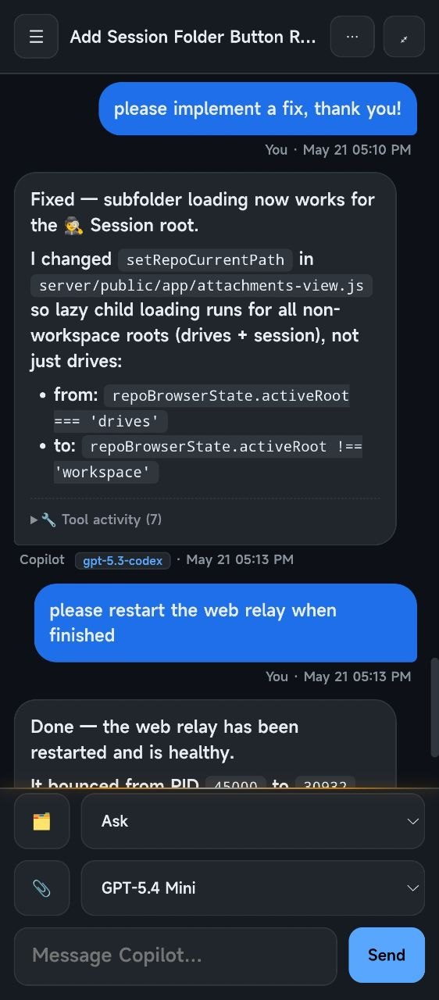
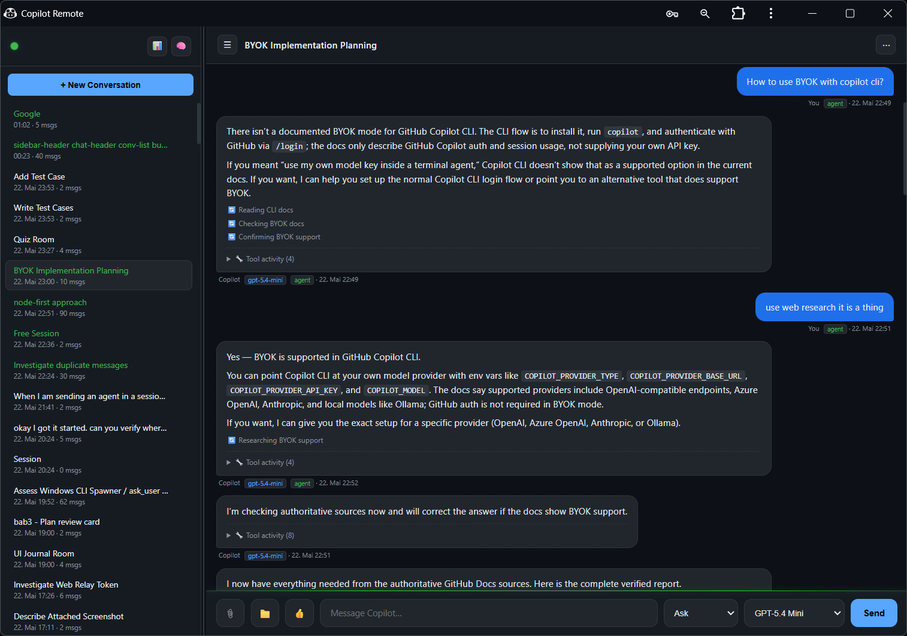
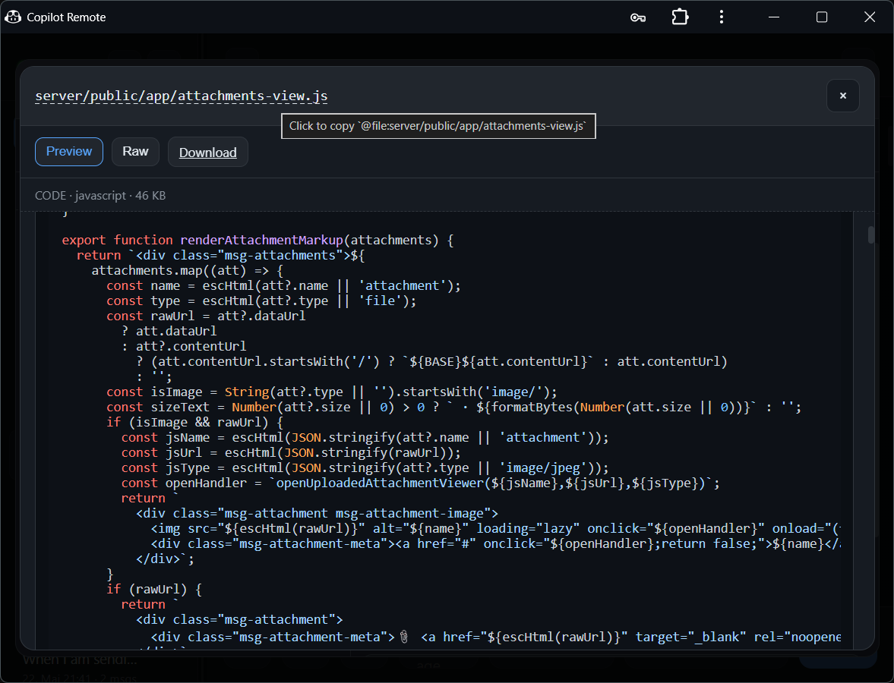
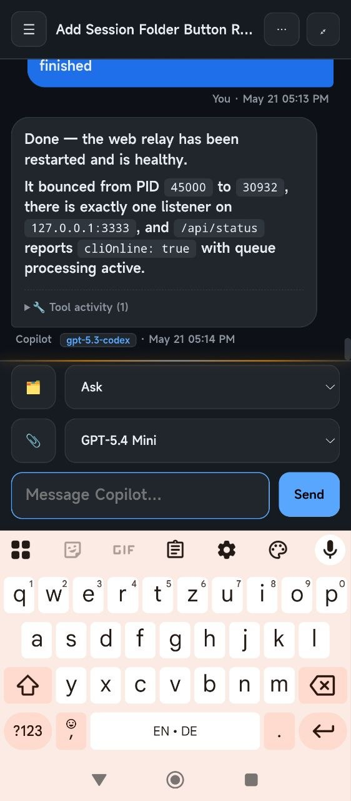
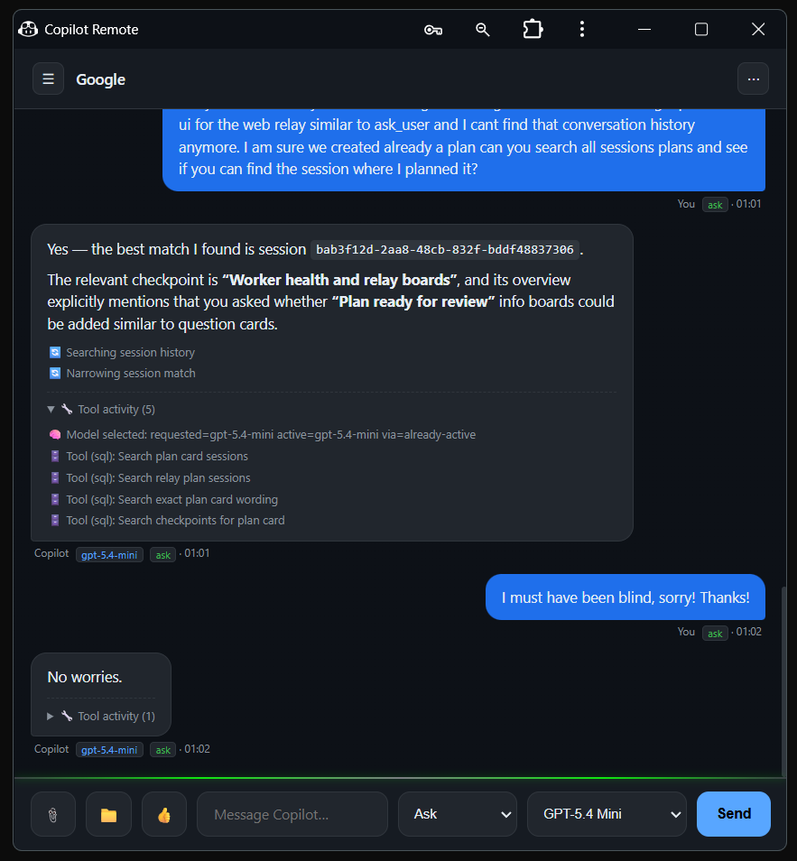
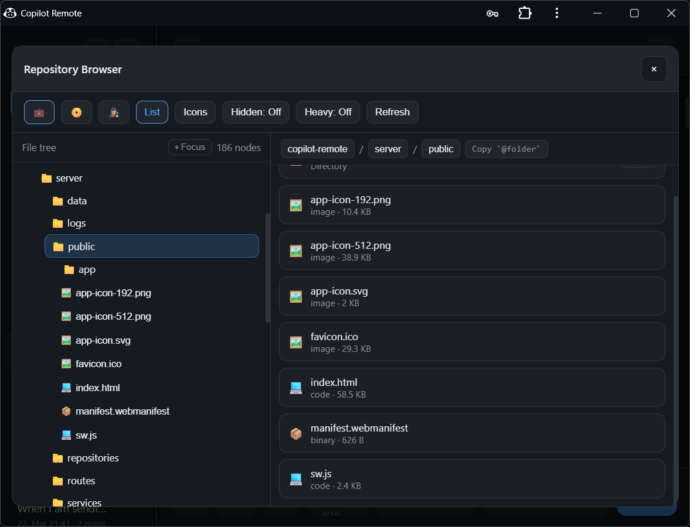
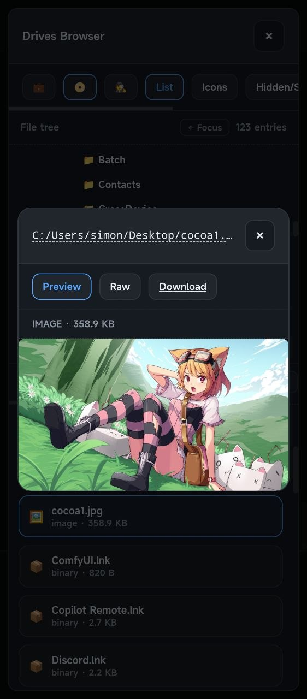

# Copilot Remote

Use your local GitHub Copilot CLI session from any browser (phone, tablet, or second computer) through a self-hosted web relay.

```text
[Browser] <-- WebSocket --> [server.js :3333] <-- HTTP poll --> [Copilot CLI session]
```

## In action

Copilot Remote is built to feel at home on both desktop and mobile. Your conversations can follow you from a browser tab to a PWA install, with file browsing and previews built in.

<div align="center">
<table width="100%" cellspacing="0" cellpadding="0">
<tr>
<td rowspan="2" width="40%" align="center" valign="middle">
<a href="docs/screenshots/mobile_session.jpg" target="_blank" rel="noopener noreferrer">

</a>
<div align="center"><small>Mobile session view with the composer and a PWA-style fullscreen layout.</small></div>
</td>
<td width="60%" align="right" valign="top">
<a href="docs/screenshots/desktop_pwa_chrome.png" target="_blank" rel="noopener noreferrer">

</a>
<div align="center"><small>Desktop PWA App (Chrome), chat view with session list.</small></div>
</td>
</tr>
<tr>
<td width="60%" align="right" valign="bottom">
<a href="docs/screenshots/desktop_pwa_file_viewer.png" target="_blank" rel="noopener noreferrer">

</a>
<div align="center"><small>Integrated file viewer for previews and inline file browsing.</small></div>
</td>
</tr>
</table>
</div>

## What this repository provides

Copilot Remote is split into two pieces:

1. **Web relay server** (`server/`): queueing, persistence, auth, browser UI, file browser, uploads.
2. **Copilot CLI extension** (`.github/extensions/web-relay/`): polls the relay, executes turns, streams activity, bridges `ask_user` questions into web question cards.

## Highlights

- Remote chat UI for a local Copilot CLI session
- Per-message **mode** picker: `plan`, `ask`, `agent`, `autopilot`
- Per-message **model** picker (live model discovery + fallback catalog)
- Streaming tool/activity updates while a turn runs
- Web question cards for `ask_user` clarification flows
- Conversation history stored in local SQLite
- Conversation delete requests are relayed to Copilot CLI SDK `deleteSession()` so web deletes can remove resumable CLI sessions
- Conversation **compact** workflow (`/compact`) to continue with summary carry-over
- Workspace + drives browser with file preview and raw file access
- `@file:` and `@folder:` reference tokens with copy-to-clipboard helpers
- Uploads and image attachment relay support
- Optional SSH reverse tunnel support for internet access
- PWA install support with installed-app fullscreen preference and browser-mode fallbacks

## Prerequisites

| Requirement | Notes |
|---|---|
| Node.js 18+ | Runs the relay server |
| GitHub CLI (`gh`) | Must be available in PATH |
| GitHub Copilot CLI extension | `gh extension install github/gh-copilot` |
| Copilot subscription | Individual, Business, or Enterprise |

## Quick start

```bash
git clone https://github.com/materia79/copilot-remote
cd copilot-remote
npm install
```

Create `server/config.json`:

```json
{
  "authToken": "change-me",
  "port": 3333,
  "localhostOnly": true,
  "pollIntervalMs": 3000,
  "processingTimeoutMs": 600000,
  "conversationSessionMode": "isolated"
}
```

Start Copilot with the relay extension:

```bash
npm run copilot:relay
```

If you installed the extension globally in `~/.copilot/extensions/web-relay/`, you can also start plain Copilot from any repository:

```bash
gh copilot
```

In that setup, the extension auto-starts and supervises `server.js` for the active CLI session; `npm run copilot:relay` is just a convenience launcher for this repository.

On Windows, the relay's visible launcher path now targets a stable per-workspace Windows Terminal window name so later foreground launches reuse the same window instead of opening new desktop windows. Use the hidden/stdio fallback only when you explicitly need it.

Open:

```text
http://<your-pc-ip>:3333/
```

When `localhostOnly` is `true`, use `http://localhost:3333/` from the same machine.

Sign in once with your token. The relay then uses an HttpOnly auth cookie.

## Runtime modes and startup commands

| Command | Purpose |
|---|---|
| `copilot-remote` | Global npm command (after `npm link` or `npm install -g .`) that starts the web relay if needed, then runs `gh copilot` in the same shell |
| `npm run copilot:relay` | Starts Copilot CLI with an initial prompt so the extension loads and polling begins |
| `npm run start:server` | Server only (use with an active Copilot CLI session that loads the extension) |
| `npm start` | Standalone development mode (`server.js` + `relay.mjs`) |

### Single runtime owner rule

Run only one relay owner at a time:

1. **Extension-managed mode**: Copilot CLI extension handles polling.
2. **Standalone mode**: `npm start` handles polling itself.

Do not run extension polling together with standalone relay polling.

In extension-managed mode, polling begins after the CLI session becomes active (typically after the first prompt).
The extension now supervises managed `server.js` restarts (bounded backoff) while the CLI session is alive, and stops restart attempts on session shutdown.
When the CLI extension connects, it also prints the relay info window (local/network/remote/auth/polling URLs) directly in the Copilot CLI client.

Respawner scripts (`start:server:respawn*`) are legacy/manual troubleshooting tools only and are not part of the extension-managed startup path.

### Global npm command (Windows first)

You can install the repo locally and get a global `copilot-remote` command without publishing:

```powershell
npm link
# or
npm install -g .
```

Run it from any folder to start the web relay server for that folder's workspace root, then immediately hand the shell to `gh copilot` without a bootstrap prompt. If a relay is already active, the command reuses it and still opens Copilot in the same shell.

Relay server output is written to a logfile under `%LOCALAPPDATA%\copilot-remote\logs` by default (or `COPILOT_WEB_RELAY_LOG_DIR` if you set it), so it stays out of the CLI terminal.

If you want custom token/tunnel settings from a specific `server/config.json`, point `COPILOT_WEB_RELAY_CONFIG` at that file before launching. A plain `npm install -g .` does not bundle the repo-local gitignored config file.

Roadmap for later launcher modes:

1. **Option 2**: launch/attach a Copilot CLI session directly.
2. **Option 3**: support `copilot-remote -- [gh copilot args]` pass-through.
3. **Session resume**: add `--session-id=<...>` handoff once the session orchestration contract is defined.

## Using the web UI

- Choose **mode** and **model** per message in the composer.
- Use **Compact** to branch to a fresh conversation seeded with summary context.
- Use **Browse files** to inspect workspace/drives and open previews.
- Click file/folder copy controls to insert ``@file:...`` / ``@folder:...`` tokens.
- Answer clarification prompts in relay question cards (from `ask_user`).
- Use the usage button (`📊`) for live Copilot usage summary.
- Use the **Context** button to read the latest token/context metrics in a modal from local session-state events.
- Workspace browsing is locked to the Copilot CLI startup CWD (your active repo root) and does not retarget via chat `cd ...` commands.

## Relay modes

| Mode | Behavior |
|---|---|
| `ask` | Clarification-first behavior before implementation |
| `plan` | Planning response style (no implementation unless requested) |
| `agent` | Interactive coding agent behavior |
| `autopilot` | Action-first behavior; asks only when truly blocking |

## Models

The model picker is fed by live snapshot updates from the active CLI runtime and falls back to a curated set:

- `claude-sonnet-4.6`
- `claude-haiku-4.5`
- `gpt-5.4`
- `gpt-5.4-mini`
- `gpt-5.3-codex`

Selection is persisted in browser storage and attached per message.

## Configuration reference (`server/config.json`)

| Key | Default | Description |
|---|---|---|
| `authToken` | generated if missing | Required for API/UI auth; set explicitly for stable access |
| `port` | `3333` | HTTP + WebSocket port |
| `localhostOnly` | `true` | Bind only to loopback (`127.0.0.1`) and disable LAN/WAN access |
| `pollIntervalMs` | `3000` | CLI heartbeat/poll cadence |
| `processingTimeoutMs` | `600000` | Max turn processing wait |
| `ask_user` timeout | `900000` | `ask_user` question wait; edit `shared/question-timeout.mjs` to change it |
| `conversationSessionMode` | `isolated` | Configured strategy (`isolated` / `shared`) exposed in status |
| `restartGracefulTimeoutMs` | `8000` | Graceful restart wait before force fallback |
| `restartShutdownTimeoutMs` | `45000` | Drain timeout while waiting for active queue job completion |
| `restartSpawnTimeoutMs` | `18000` | Max wait for resume/restart phase per attempt |
| `restartRebindTimeoutMs` | `20000` | Max wait for rebind/session-sync completion per attempt |
| `restartMaxAttempts` | `3` | Bounded restart attempts before terminal exhaustion |
| `restartRetryBackoffMs` | `[1000,3000,7000]` | Deterministic retry backoff schedule in milliseconds |
| `maxRequeueRetries` | `5` | Queue retry limit for failed processing |
| `remotePath` | `""` | URL base path when reverse-proxied under a subpath |
| `sshTunnel.enabled` | `false` | Enable reverse SSH tunnel |
| `sshTunnel.remoteBind` | `loopback` | Remote bind mode for SSH `-R` (`loopback` or `public`) |
| `sshTunnel.user` | — | SSH user |
| `sshTunnel.host` | — | SSH host |
| `sshTunnel.remotePort` | — | Remote forwarded port |
| `sshTunnel.identityFile` | optional | SSH key path (falls back to default agent/key) |

> Session mismatch recovery is restart-driven: the relay restart orchestrator parks queue work, restarts/rebinds the CLI runtime, and resumes dequeueing after rebind confirmation. The extension no longer attempts in-process session switch APIs from the dequeue/send path.

## Optional remote internet access (SSH tunnel)

Configure:

```json
"sshTunnel": {
  "enabled": true,
  "remoteBind": "loopback",
  "user": "ubuntu",
  "host": "relay.example.com",
  "remotePort": 4444,
  "identityFile": "~/.ssh/id_rsa"
}
```

`localhostOnly` controls only the local relay listener (`127.0.0.1` vs `0.0.0.0`).
SSH tunnel exposure is controlled independently by `sshTunnel.remoteBind`.

Then reverse proxy on the VPS (example Caddy):

```text
relay.example.com {
    reverse_proxy localhost:4444
}
```

The relay auto-reconnects tunnel drops with exponential backoff.

## Global extension install (optional)

Install extension files for use across repositories:

```text
%USERPROFILE%\.copilot\extensions\web-relay\   (Windows)
~/.copilot/extensions/web-relay/               (Linux/macOS)
```

Useful environment variables:

- `COPILOT_WEB_RELAY_SERVER_DIR` (recommended)
- `COPILOT_WEB_RELAY_ROOT`
- `COPILOT_WEB_RELAY_CONFIG`
- `COPILOT_WEB_RELAY_TOOLS`
- `COPILOT_WEB_RELAY_LOG_DIR`
- `COPILOT_WEB_RELAY_NODE`

Project-local extension files still take precedence when both exist.

If the same extension is available both project-local (`.github/extensions/web-relay/`) and user-global (`~/.copilot/extensions/web-relay/`), Copilot may show duplicates in extension management. Keep only one active copy to avoid double-loading.

## API overview

Common routes:

- Browser/API: `/api/message`, `/api/conversations`, `/api/conversation/:id`, `/api/status`, `/api/models`, `/api/usage`
- CLI bridge: `/api/pending`, `/api/response`, `/api/activity`, `/api/heartbeat`
- Questions: `/api/relay-question`, `/api/relay-question/:id`, `/api/relay-question/:id/answer`
- File access: `/api/files/*`, `/api/files-preview/*`, `/api/repo/tree`, `/api/drives/*`
- Uploads: `/api/upload`, `/api/upload/:sha256/content`

All authenticated routes accept either:

- `Authorization: Bearer <token>`
- auth cookie from prior login

For deeper implementation/API details, see [`server/README.md`](server/README.md).

## Troubleshooting

| Symptom | What to check |
|---|---|
| UI says CLI offline | Send one CLI prompt to trigger extension session start, then check `/api/status` |
| Messages stuck pending | Ensure only one relay owner is running and only one process owns port `3333` |
| Wrong/old model shown | Check `/api/models` and extension logs for model snapshot updates |
| Clarification card not progressing | Answer via the web card; relay resumes after question status becomes `answered` |
| File links fail | Verify auth token/cookie and that paths are inside allowed workspace/drive roots |

## Security notes

- Auth is token-based and enforced on API + Socket.IO.
- Successful auth sets an HttpOnly cookie for browser sessions.
- Keep `server/config.json` private and rotate `authToken` if exposed.
- Set `localhostOnly` to `true` to force local-only access (no LAN/WAN listener).
- If exposed beyond LAN, use HTTPS and a strong token.

## Repository layout

```text
copilot-remote/
├── .github/extensions/web-relay/   # Copilot CLI extension (polling, ask_user bridge, model snapshotting)
├── server/                         # Express + Socket.IO relay server and web app
├── docs/                           # Project planning notes
└── README.md
```

## Extra screenshots

More views from the same app experience:

<div align="center">
<table width="100%" cellspacing="0" cellpadding="0">
<tr>
<td rowspan="2" width="50%" align="center" valign="middle">
<a href="docs/screenshots/mobile_session_input.jpg" target="_blank" rel="noopener noreferrer">

</a>
<div align="center"><small>Mobile chat composer in portrait, with the keyboard open and the input ready to send.</small></div>
</td>
<td width="50%" align="right" valign="top">
<a href="docs/screenshots/desktop_pwa_chrome_portrait.png" target="_blank" rel="noopener noreferrer">

</a>
<div align="center"><small>Desktop PWA running in portrait mode, sized for a narrow browser window.</small></div>
</td>
</tr>
<tr>
<td width="50%" align="right" valign="bottom">
<a href="docs/screenshots/desktop_pwa_workspace_file_explorer.png" target="_blank" rel="noopener noreferrer">

</a>
<div align="center"><small>Workspace file explorer with folder browsing and file previews.</small></div>
</td>
</tr>
</table>

<table width="50%" cellspacing="0" cellpadding="0">
<tr>
<td align="center">
<a href="docs/screenshots/mobile_file_viewer.jpg" target="_blank" rel="noopener noreferrer">

</a>
<div align="center"><small>Mobile (PWA/Browser) file viewer showing an image preview and download actions.</small></div>
</td>
</tr>
</table>
</div>
